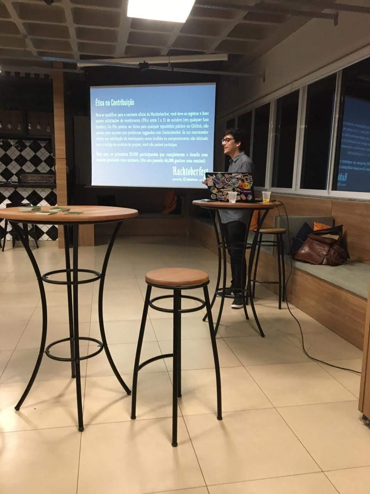

## Sobre o Evento

- **Data**: 2019-10-11
- **Local**: Grupo TecnoSpeed — R. Vitório Balani, 1211
- **Cidade / Estado**: Maringá / PR
- **Organizador**: DevParaná
- **Link**: https://www.meetup.com/pt-br/developerparana/events/265404132/?eventOrigin=group_events_list

## Palestras Apresentadas

- *Como começar a contribuir com projetos open source?* — Versão original da talk [[talk-github_and_open_source_community|GitHub e Comunidade Open Source]]
  > "Sendo iniciando em programação, também é possível contribuir com projetos de código aberto na internet, o importante é não ter medo de errar e acreditar na comunidade em que você faz parte."

## Programação / Trilhas

- **Enderson Menezes** — Como começar a contribuir com projetos open source?
- Espaço aberto para PRs ao vivo durante o evento (Hacktoberfest)

## Materiais e Fotos

