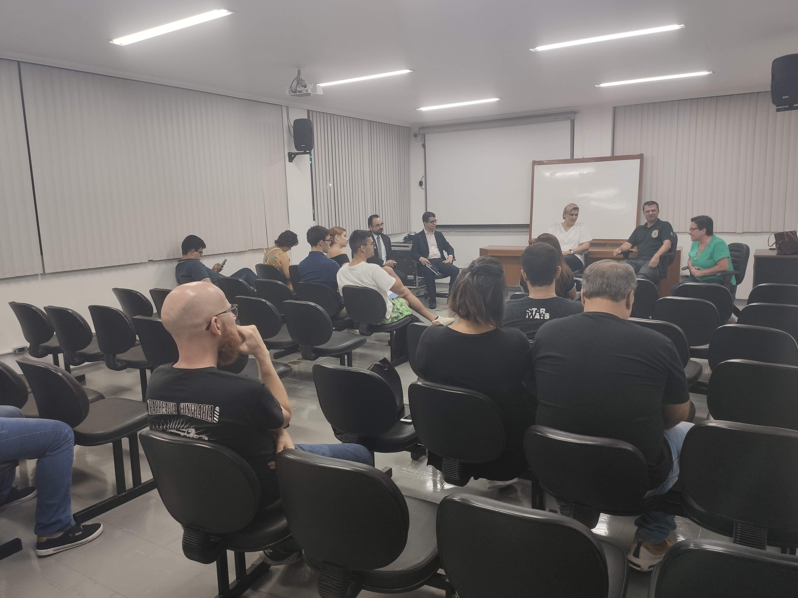

## Sobre o Evento

- **Data**: 2020-02-11
- **Local**: Câmara dos Vereadores (Plenarinho) — Av. Papa João XXIII, 239
- **Cidade / Estado**: Maringá / PR
- **Organizador**: DevParaná
- **Link**: https://www.meetup.com/pt-br/developerparana/events/268510043/?eventOrigin=group_events_list

## Meu Papel

- **Organizador e mediador** da Mesa Redonda *"Uso Seguro da Internet"*

## Palestras Apresentadas

- Mesa Redonda *"Uso Seguro da Internet"* — Mediador: Enderson Menezes

## Programação / Trilhas

Mesa Redonda com 5 profissionais debatendo uso seguro, ético e responsável da internet:

| Participante | Área |
|---|---|
| Thomaz Jefferson | Advogado, Direito Digital (Lei Rose Leonel) |
| Paulo Bandolin | Agente de Polícia Federal — Crimes Cibernéticos |
| Célia Cortellete | Psicologia jurídica — NUCRIA |
| Maria Carolina Lolli | Neuropsicopedagogia Clínica e Institucional |
| Ivan Coelho Dias | Advogado, Direito Empresarial e Digital |

## Anotações e Destaques

<!-- O que foi mais relevante, aprendizados, insights -->

## Contatos Feitos

| Nome | Empresa / Papel | Contato |
|------|----------------|----------|
|  |  |  |

## Materiais e Fotos

