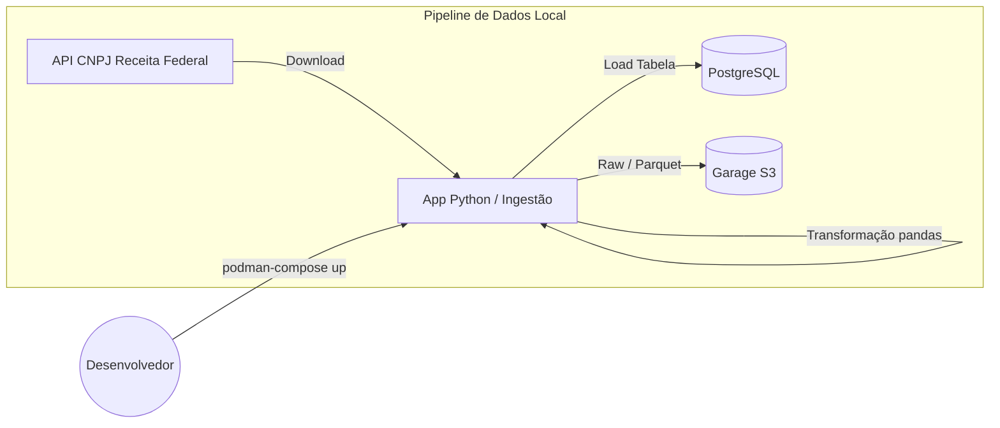

# Artefatos do Encontro



> 📁 Arquivos prontos para os labs: `encontro1-files/`
> Inclui `compose.yaml`, `Containerfile`, `Makefile`, `requirements.txt` e `src/ingest.py`.
---
← [[note_devops_mlops_eng_dados|Voltar ao Índice]] | Próximo → [[note_class_02|Encontro 2]]
# Encontro 1 — Fundamentos DevOps para Engenharia de Dados (~10h)

## Objetivo do Encontro

Ao final deste encontro o aluno será capaz de containerizar uma aplicação de dados, compor ambientes multi-serviço com Podman Compose e estruturar um repositório Git profissional.

---
## Parte 1 — Teoria

### 1.1 Cultura DevOps: História e Princípios

A transição de processos pesados para entregas contínuas mudou a forma como desenvolvemos software e aplicamos isso à Engenharia de Dados.

- **Origens:** O movimento nasceu para quebrar os silos entre quem desenvolve (Dev) e quem opera (Ops), herdando a agilidade do manifesto Agile e a eficiência da manufatura Lean.
- **Os 3 Caminhos (The Three Ways):**
  1. *Flow (Fluxo):* Acelerar a entrega do Dev para Ops, minimizando gargalos.
  2. *Feedback:* Ampliar o retorno de Ops para Dev, antecipando problemas em produção.
  3. *Continuous Learning:* Cultura de experimentação, aprendizado com falhas e domínio técnico contínuo.
- **Modelo CALMS:** Acrônimo que resume a adoção: **C**ulture (Cultura colaborativa), **A**utomation (Eliminar trabalho manual repetitivo), **L**ean (Lotes pequenos, redução de desperdício), **M**easurement (Métricas orientam decisões) e **S**haring (Compartilhamento de conhecimento).
- **Métricas DORA:** O termômetro do DevOps — *Deployment Frequency*, *Lead Time for Changes*, *Time to Restore Service*, e *Change Failure Rate*.
- **DevOps em Dados:** Pipelines frágeis atrasam decisões de negócio. DevOps garante reprodutibilidade, testes de qualidade, monitoramento e agilidade no deploy das transformações de dados.

**Referências:**
- Kim et al., *The Phoenix Project* (2013)
- Forsgren et al., *Accelerate* (2018)
- DORA / Google, *DORA Research Program*: <https://dora.dev/research/>

### 1.2 Containers: OCI, Podman e Boas Práticas

Containers empacotam o código e todas as suas dependências para que a aplicação rode de forma idêntica e previsível em qualquer lugar.

- **Containers vs VMs:** Compartilham o kernel do host (mais leves, rápidos e eficientes que Máquinas Virtuais). A *OCI (Open Container Initiative)* padroniza o formato da imagem.
- **Por que Podman?** Em ambientes corporativos, segurança é fundamental. Podman é *rootless* (não precisa de privilégios admin) e *daemonless* (sem um processo central que possa ser ponto único de falha). Compatibilidade direta: `alias docker=podman`.
- **Anatomia Básica de um Containerfile:**
  ```dockerfile
  # Exemplo de Multi-stage build para App Python
  FROM python:3.14-slim as builder
  WORKDIR /app
  COPY requirements.txt .
  RUN pip install --user -r requirements.txt
  
  FROM python:3.14-slim
  WORKDIR /app
  COPY --from=builder /root/.local /root/.local
  COPY src/ ./src/
  ENV PATH=/root/.local/bin:$PATH
  CMD ["python", "src/ingest.py"]
  ```
- **Layers e Cache:** Cada comando gera uma camada. Alterar uma linha invalida o cache dela para baixo (por isso copiamos o `requirements.txt` antes do código fonte real).
- **Boas Práticas:** Usar imagens `-slim`, definir `.containerignore` para não vazar credenciais ou enviar dados pesados para o daemon, e rodar como usuário não-root.

**Referências:**
- Documentação oficial Podman: <https://podman.io/docs>
- Open Container Initiative: <https://opencontainers.org/>

### 1.3 Orquestração Local: Podman Compose

Pipelines de dados envolvem múltiplos componentes. Precisamos orquestrá-los localmente antes de enviar para produção.

- **O formato `compose.yaml`:** Mapeia declarativamente como os containers rodam, interagem (redes internas isoladas) e persistem estado (volumes locais).
- **Patterns para Dados:** Uma tripla comum para desenvolvimento local:
  1. *Serviço de Ingestão* (App Python)
  2. *Banco de Dados Relacional* (PostgreSQL para dados tabulares tratados)
  3. *Object Storage* (Garage ou MinIO, compatíveis com API S3, para data lake raw)
- **A Importância dos Healthchecks:** O pipeline de ingestão só deve rodar quando o PostgreSQL estiver aceitando conexões. 
  ```yaml
  # Exemplo de Healthcheck em dependência
  depends_on:
    db:
      condition: service_healthy
  ```
- **Debugging Essencial:** Comandos como `podman-compose logs -f` e `podman exec -it <container> /bin/bash`.

**Referências:**
- Podman Compose: <https://github.com/containers/podman-compose>
- Garage (S3-compatible object storage): <https://garagehq.deuxfleurs.fr/>
- Garage Quick Start: <https://garagehq.deuxfleurs.fr/documentation/quick-start/>

### 1.4 Versionamento: Git Avançado

Não basta salvar o código; o histórico precisa ser legível e acionar automações (CI/CD) de forma confiável.
- **Estratégias de Branching:** O foco atual é *Trunk-based Development* ou *GitHub Flow*. Branches de vida curta (short-lived), com CI rodando em pull requests e merges frequentes, evitando o temido "merge hell" do GitFlow clássico.
- **Conventional Commits:** Padroniza a comunicação da equipe com o formato `tipo(escopo): descrição`. Permite automação de releases.
  - `feat:` Nova fonte de dados ou feature.
  - `fix:` Correção em pipeline ou query.
  - `chore:` Atualização de configuração (ex: dependências).
- **O `.gitignore` em Dados:** Regra de ouro: nunca commitar arquivos `.csv`, `.parquet`, `.sqlite` ou credenciais (`.env`).
- **Monorepo vs Multirepo:** Em engenharia de dados, manter infra (IaC), código da app e DAGs do orquestrador no mesmo repositório (monorepo) simplifica o CI/CD no estágio inicial da maturidade MLOps.

**Referências:**
- Chacon & Straub, *Pro Git* (2014) — gratuito: <https://git-scm.com/book/en/v2>
### 1.5 IaC Conceitual

- Infrastructure as Code: o que é, por que importa
- Declarativo vs imperativo
- Ferramentas: Terraform, Pulumi, Ansible (visão geral)
- IaC para engenharia de dados: provisionamento de clusters, bancos, storage
**Referências:**
- Morris, *Infrastructure as Code* (O'Reilly, 2020)
### 1.6 Architecture Decision Records — ADRs

- O que são ADRs e por que documentar decisões técnicas
- Formato: Título, Contexto, Decisão, Consequências
- Quando escrever um ADR (escolhas de ferramenta, padrões de arquitetura, trade-offs)
- Template recomendado: [MADR](https://adr.github.io/madr/) (Markdown ADR)

**Referências:**
- Nygard, "Documenting Architecture Decisions" (2011) — <https://cognitect.com/blog/2011/11/15/documenting-architecture-decisions>
- MADR: <https://adr.github.io/madr/>

> 💡 **Nota:** ADRs são parte da avaliação. O projeto incremental deve conter pelo menos 3 ADRs documentando decisões técnicas (ver [[note_evaluation|Método de Avaliação]]).

---
# Artefatos-base do Encontro

- **Repositório-template** com scaffolding Python, `Containerfile` base e `compose.yaml` inicial
- **Fonte de dados:** Base pública de CNPJ da Receita Federal (<https://dadosabertos.rfb.gov.br/CNPJ/>)
- **Checklist de setup** com Podman, Podman Compose, Git e GitHub
- **README base** com instruções mínimas e estrutura sugerida do projeto

---
## Parte 2 — Laboratórios Práticos (Visão em Sala + Execução em Casa)

> [!INFO] Dinâmica dos Laboratórios
> Durante o encontro presencial/síncrono, os labs a seguir serão **"pincelados"** pelo professor. O foco da aula é apresentar o funcionamento das ferramentas na prática e solucionar dúvidas de arquitetura, garantindo que você tenha a base necessária.
>
> A execução e conclusão completa de **todos os laboratórios** é parte da avaliação do curso e deve ser feita como trabalho de casa (Homework).

> [!TIP] Foco Personalizado
> Lembre-se: o conteúdo é amplo. Adapte os labs ao seu objetivo principal na pós-graduação. Se você tem maior interesse em DevOps, preste muita atenção aos detalhes do `Containerfile` e `compose.yaml`. Se prefere Engenharia de Dados, aproveite os labs de ingestão e transformação para escrever um código mais robusto.

### Lab 1.1 — Containerizando uma Aplicação de Dados

**Objetivo:** Criar um Containerfile para uma aplicação Python que ingere dados de uma API pública.

**Passos:**
1. Criar projeto Python com `pyproject.toml` ou `requirements.txt`
2. Escrever script de ingestão (ex: API do IBGE, OpenWeather, ou dados.gov.br)
3. Criar Containerfile com multi-stage build
4. Build e teste local com `podman build` e `podman run`
5. Validar que os dados são extraídos corretamente

> 💡 **Turma mista:** Para alunos com menos experiência em Python/containers, utilizaremos o **repositório oficial** [endersonmenezes/pos-ia-eng-devops](https://github.com/endersonmenezes/pos-ia-eng-devops) com scaffolding (estrutura de pastas, Containerfile base, script parcial). Alunos avançados partem do zero.

**Entregável:** Containerfile funcional + script de ingestão no repositório local.

### Lab 1.2 — Ambiente Multi-Serviço com Podman Compose

**Objetivo:** Compor ambiente completo com app + PostgreSQL + Garage.

**Passos:**
1. Criar `compose.yaml` com 3 serviços
2. Configurar volumes persistentes para PostgreSQL
3. Configurar Garage como object storage local compatível com API S3 (<https://garagehq.deuxfleurs.fr/documentation/quick-start/>)
4. Healthchecks para garantir ordem de inicialização
5. Testar ingestão → transformação → persistência

**Entregável:** `compose.yaml` funcional no diretório local.

### Lab 1.3 — Estruturando o Repositório

**Objetivo:** Criar repositório GitHub com estrutura profissional.

**Passos:**
1. Inicializar repo com README descritivo
2. Adicionar `.gitignore` (Python + dados)
3. Criar `Makefile` com targets: `build`, `up`, `down`, `test`, `clean`
4. Primeiro commit seguindo Conventional Commits
5. Push para GitHub

**Entregável:** Repositório público no GitHub com estrutura limpa.

### Lab 1.4 — Pipeline Batch Completo

**Objetivo:** Pipeline que ingere → transforma → persiste dados.

**Passos:**
1. Ingerir dados de CNPJ da Receita Federal (arquivos `EmpresasN.zip` e `EstabelecimentosN.zip`)
   - Portal: <https://dados.gov.br/dados/conjuntos-dados/cadastro-nacional-da-pessoa-juridica---cnpj>
   - Arquivos: <https://dadosabertos.rfb.gov.br/CNPJ/>
2. Transformar com pandas (encoding latin-1, separador `;`, sem header, normalização de datas e capital social)
3. Persistir em PostgreSQL (tabela tratada) e/ou Garage (Parquet em bucket S3)
4. Rodar tudo via `podman compose up`
5. Validar dados persistidos com queries SQL
    5.1 Jupyter Notebooks consultando o banco de dados.

**Entregável:** Pipeline funcional rodando via compose.

---
## Critério mínimo de conclusão do encontro

- Containerfile gera imagem executável localmente
- `compose.yaml` sobe app + PostgreSQL + Garage sem ajustes manuais ad hoc
- Repositório no GitHub contém README, `.gitignore`, `Makefile` e pipeline batch funcional
---
## Atividade de Reposição

Para alunos que não puderem comparecer ao Encontro 1:

1. **Fork** do repositório template disponibilizado pelo professor
2. Completar **todos os 4 labs** seguindo o README de cada um
3. **Gravar vídeo de 5 minutos** explicando:
   - Decisões técnicas tomadas (por que escolheu determinada base image, estrutura, etc.)
   - Dificuldades encontradas e como resolveu
   - Demonstração do pipeline rodando
4. Submeter via **Pull Request** no repositório da turma

**Prazo:** até o próximo encontro.

> 💬 **Dúvidas:** alunos em reposição podem buscar suporte via **Issues no repositório da turma**.

---
## Checklist do Encontro

- [ ] Alunos têm Podman instalado e funcionando
- [ ] Alunos têm conta no GitHub
- [ ] Repositório template preparado pelo professor durante aula prática
- [ ] API CNPJ Receita Federal testada e arquivos acessíveis
- [ ] Ambiente compose validado (API)

---

# Curiosidades

- **Metabase com Podman Compose:** Sabia que você pode subir uma ferramenta completa de Business Intelligence em minutos? O Metabase se integra perfeitamente ao Podman Compose. Com apenas um serviço adicional no seu `compose.yaml` conectando ao banco PostgreSQL local (ou outro banco), você consegue explorar, visualizar e criar dashboards dos dados ingeridos, sem precisar de infraestrutura na nuvem ou configurações complexas. É uma excelente forma rápida de validar o impacto visual do seu pipeline de engenharia de dados!

- A flag `-d` significa **detached**, ou seja, o container será executado em segundo plano.
- A flag `-p 3000:3000` significa que a porta 3000 do container será mapeada para a porta 3000 do host.
- A flag `--name metabase` significa que o container será chamado de metabase.
- A flag `metabase/metabase` significa que o container será criado a partir da imagem metabase/metabase.

## Exemplo de Execução

```bash
podman run -d -p 3000:3000 --name metabase metabase/metabase
```

## Exemplo com Podman Compose

```yaml
services:
  metabase:
    image: metabase/metabase
    container_name: metabase
    ports:
      - "3000:3000"
    volumes:
      - metabase-data:/metabase
    environment:
      - MB_DB_TYPE=postgres
      - MB_DB_DBNAME=postgres
      - MB_DB_USER=postgres
      - MB_DB_PASS=postgres
      - MB_DB_PORT=5432
      - MB_DB_HOST=postgres
    depends_on:
      - postgres
  
  postgres:
    image: postgres
    container_name: postgres
    environment:
      - POSTGRES_DB=postgres
      - POSTGRES_USER=postgres
      - POSTGRES_PASSWORD=postgres
    ports:
      - "5432:5432"
    volumes:
      - postgres-data:/var/lib/postgresql/data

volumes:
  metabase-data:
```

```bash
podman compose up -d
```
