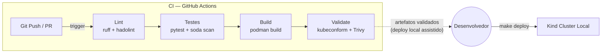

# Artefatos do Encontro



> 📁 Os arquivos base para os labs já estão no repositório do projeto.
> Incluem `ci.yml`, `checks.yml`, manifests na pasta `k8s/`, `Makefile` atualizado e `kind-config.yaml`.
---
← [[note_class_01|Encontro 1]] | [[note_devops_mlops_eng_dados|Voltar ao Índice]] | Próximo → [[note_class_03|Encontro 3]]

# Encontro 2 — CI, Kubernetes Local e DataOps

## Objetivo do Encontro

Ao final deste encontro o aluno será capaz de criar pipelines de CI com GitHub Actions, implementar testes de qualidade de dados, validar manifests e operar deploy local de aplicações em Kubernetes com Kind.

---

## Parte 1 — Teoria

### 2.1 CI/CD: Princípios e GitHub Actions

CI/CD é a espinha dorsal de um fluxo de entrega moderno: automações que garantem que cada mudança no código seja validada, construída e disponibilizada com segurança.

- **Integração Contínua vs Entrega Contínua vs Deploy Contínuo:** CI detecta problemas cedo — cada push dispara validações automáticas. CD (Entrega) empacota o artefato validado e o torna elegível para deploy. Deploy Contínuo vai além e coloca em produção automaticamente, exigindo maior maturidade de testes e observabilidade.
- **Anatomia de um Pipeline de CI:** A sequência canônica é `lint → test → build → scan → validate`. Cada stage tem responsabilidade única e deve falhar rápido (*fail fast*) para não desperdiçar recursos de runner.
- **CD Automatizado vs Operação Local Assistida:** Em times menores ou com infraestrutura local (como neste curso), o deploy costuma ser assistido — o CI valida, o engenheiro decide e executa com `make deploy`. CD completamente automatizado requer monitoramento avançado e rollback confiável.
- **GitHub Actions:** Workflows são arquivos YAML em `.github/workflows/`. Compostos por `jobs` paralelos ou sequenciais, com `steps` que executam `actions` reutilizáveis ou comandos shell. `secrets` são variáveis criptografadas gerenciadas pelo repositório.
  ```yaml
  # ci.yml — Exemplo mínimo de workflow CI
  name: CI
  on: [push, pull_request]
  jobs:
    lint-and-test:
      runs-on: ubuntu-latest
      steps:
        - uses: actions/checkout@v4
        - uses: actions/setup-python@v5
          with: { python-version: "3.11" }
        - run: pip install ruff pytest
        - run: ruff check .
        - run: pytest
  ```
- **Boas Práticas:** Usar `fail-fast: true` em matrix builds; cachear dependências com `actions/cache`; paralelizar jobs independentes; jamais commitar secrets (use `${{ secrets.NOME }}`).
- **Métricas DORA:** O pipeline de CI impacta diretamente *Lead Time for Changes* (tempo do commit ao deploy) e *Change Failure Rate* (percentual de deploys que causam incidentes). Um CI sólido é pré-requisito para melhorar ambas.
- **Segurança — Secrets e OIDC:** `GITHUB_TOKEN` é injetado automaticamente com escopo mínimo. Para acesso a cloud providers, prefira OIDC (sem credentials estáticas): o runner assume uma role temporária via federação de identidade.
- **Segurança de Imagens — Trivy:** Scanner de vulnerabilidades OSS que analisa camadas da imagem contra CVEs conhecidos. Integrado como step no CI, bloqueia a publicação de imagens com vulnerabilidades críticas.

**Referências:**
- Humble & Farley, *Continuous Delivery* (2010) — [Amazon](https://www.amazon.com/dp/0321601912)
- GitHub Actions Docs: <https://docs.github.com/en/actions>
- DORA / Google, *DORA Research Program*: <https://dora.dev/research/>
- Trivy Docs: <https://trivy.dev/latest/docs/>

### 2.2 Testes para Dados

Código sem testes é técnica sem disciplina — e dados sem testes são pipelines prontos para falhar silenciosamente em produção.

- **Por que testar dados?** Diferentemente de bugs em código (que geram erros), falhas de dados muitas vezes *passam despercebidas*: um campo nulo, um valor fora de faixa, um schema que evoluiu sem comunicação. *Data contracts* formalizam as expectativas entre quem produz e quem consome os dados. *Schema evolution* não gerenciada quebra consumidores downstream.
- **Great Expectations:** Framework Python maduro para validação de dados. Organizado em *Expectation Suites* (conjuntos de regras declarativas), *Checkpoints* (execuções agendadas ou acionadas por CI) e *Data Docs* (relatórios HTML automáticos). Suporta Pandas, Spark e bancos SQL. Mais expressivo, com curva de configuração mais alta.
- **Soda Core:** Alternativa mais simples, configurada via YAML puro. Define `checks` declarativos (sem código Python) e roda `soda scan` para validar. Integra nativamente com Slack, PagerDuty e CI/CD. Boa escolha quando a equipe prefere configuração sobre código.
  ```yaml
  # checks.yml — Soda Core para tabela cnpj_empresas
  checks for cnpj_empresas:
    - row_count > 0
    - missing_count(cnpj_basico) = 0
    - duplicate_count(cnpj_basico) = 0
    - values in (porte_empresa) must exist in [1, 2, 3, 4, 5]
  ```
- **Testes Unitários para Transformações (pytest):** Funções de transformação devem ser testáveis isoladamente — recebem um DataFrame de entrada e produzem um DataFrame esperado. Mocks de banco de dados e fixtures de dados minimizam dependências externas nos testes.
- **Data Quality como Gate no CI/CD:** `soda scan` e `great_expectations checkpoint run` retornam exit code não-zero quando há falhas, o que naturalmente falha o step do CI. Dados inválidos nunca chegam ao banco de produção.

**Referências:**
- Great Expectations Docs: <https://docs.greatexpectations.io/>
- Soda Core Docs: <https://docs.soda.io/>

### 2.3 Kubernetes: Arquitetura e Conceitos

Quando um único container não basta — quando precisamos de escala, resiliência e auto-recuperação —, o Kubernetes assume o papel de sistema operacional dos containers.

- **Por que Kubernetes?** Gerencia o ciclo de vida de containers em múltiplos nodes: agenda (scheduling), reinicia falhas automaticamente, escala horizontalmente e distribui tráfego. Para pipelines de dados, permite isolar workloads, garantir recursos mínimos e versionar deploys com rollback.
- **Arquitetura:** O *control plane* (API Server, etcd, Scheduler, Controller Manager) é o cérebro do cluster. Os *nodes* (workers) executam os Pods via `kubelet` (agente local) e `kube-proxy` (regras de rede). Em desenvolvimento local, o Kind simula ambos em containers Docker/Podman.
- **Objetos Fundamentais:**
  - *Pod:* Unidade mínima — um ou mais containers que compartilham rede e volumes. Efêmero por natureza.
  - *Deployment:* Garante que N réplicas de um Pod estejam sempre rodando; gerencia rolling updates e rollbacks.
  - *Service:* Expõe Pods como um endpoint estável (IP/DNS interno), abstraindo quais instâncias estão saudáveis.
  - *Namespace:* Isolamento lógico de recursos dentro do cluster (ex: `dev`, `staging`, `prod`).
- **ConfigMaps e Secrets:** Separam configuração do código. ConfigMaps armazenam dados não-sensíveis (URL do banco, parâmetros de execução); Secrets armazenam dados sensíveis (senhas, tokens) encodados em base64. Ambos são montados como variáveis de ambiente ou volumes.
  ```yaml
  # k8s/deployment.yaml — injeção de config e secret
  env:
    - name: DB_HOST
      valueFrom:
        configMapKeyRef:
          name: app-config
          key: db_host
    - name: DB_PASSWORD
      valueFrom:
        secretKeyRef:
          name: app-secrets
          key: db_password
  ```
- **Persistência — PV, PVC, StorageClass:** Containers são efêmeros; dados precisam sobreviver a reinícios. *PersistentVolume (PV)* é o disco físico (ou cloud disk) provisionado pelo admin. *PersistentVolumeClaim (PVC)* é o pedido do Pod por armazenamento (tamanho, access mode). *StorageClass* automatiza a criação dinâmica de PVs sem intervenção manual.
- **Networking — ClusterIP, NodePort, Ingress:** `ClusterIP` expõe o Service apenas internamente ao cluster. `NodePort` abre uma porta fixa no node para acesso externo básico (desenvolvimento). `Ingress` é um roteador HTTP/HTTPS que mapeia hosts e paths para Services — o padrão para produção.

**Referências:**
- Burns et al., *Kubernetes: Up & Running*, 3rd ed. (O'Reilly, 2022) — [Amazon](https://www.amazon.com/dp/1098110196)
- Kubernetes Docs: <https://kubernetes.io/docs/>

### 2.4 Kind: Cluster Local para Desenvolvimento

Antes de operar em produção, precisamos de um cluster Kubernetes que rode localmente, sem custo e sem burocracia — é exatamente o que o Kind oferece.

- **O que é Kind:** *Kubernetes IN Docker* (ou Podman). Cada node do cluster é um container, tornando criação e destruição de clusters uma questão de segundos. Ideal para desenvolvimento e testes de integração de manifests.
- **Configuração de Cluster Multi-node:** Um arquivo YAML define a topologia — quantos control-planes e workers.
  ```yaml
  # kind-config.yaml — cluster com 1 control-plane e 2 workers
  kind: Cluster
  apiVersion: kind.x-k8s.io/v1alpha4
  nodes:
    - role: control-plane
    - role: worker
    - role: worker
  ```
- **Carregando Imagens Locais:** Por padrão, o Kind não acessa o registro local do host. É preciso carregar a imagem explicitamente: `kind load docker-image minha-app:latest`. Sem esse passo, o Kubernetes tentará baixar do Docker Hub e falhará com `ImagePullBackOff`.
- **Limitações vs Cluster Real:** Sem balanceador de carga externo (LoadBalancer type não funciona nativamente), sem storage class dinâmico out-of-the-box, performance limitada ao host local. Para produção, use EKS, GKE, AKS ou clusters bare-metal.
- **Alternativas:** `minikube` (mais antigo, suporta VM ou container); `k3d` (wrapper do k3s em Docker, mais leve); `k3s` (distribuição K8s ultra-leve da Rancher, para IoT e edge). Para este curso, Kind é a escolha por simplicidade e compatibilidade com Podman.

**Referências:**
- Kind Docs: <https://kind.sigs.k8s.io/>

### 2.5 DataOps: Observabilidade e Orquestração

DataOps aplica os princípios de DevOps ao ciclo de vida completo dos dados — desde a ingestão até o consumo analítico — com foco em qualidade, observabilidade e velocidade de entrega.

- **DataOps como Extensão de DevOps para Dados:** Enquanto DevOps encurta o ciclo de entrega de software, DataOps encurta o ciclo de entrega de *dados confiáveis*. Os mesmos princípios — automação, feedback rápido, colaboração — se aplicam: CI/CD para pipelines, testes de qualidade, monitoramento contínuo.
- **Observabilidade — Métricas, Logs e Traces:** Os três pilares clássicos se traduzem para dados como: *logs de execução* dos pipelines (quem rodou, quando, com quais parâmetros), *métricas de qualidade* (linhas processadas, taxa de erro, distribuição de valores), e *traces de linhagem* (de onde vieram os dados e como foram transformados).
- **Sinais Mínimos para o Curso:** Para nosso contexto, o essencial é: logs estruturados em JSON do pipeline de ingestão, healthchecks do `compose.yaml`, e `kubectl get pods` com status dos containers no Kind. Esses sinais básicos já permitem diagnosticar 80% dos problemas em ambiente local.
- **Orquestradores — Visão Comparativa (sem lab, apenas contexto):**
  - *Apache Airflow:* Mais maduro, baseado em DAGs Python, ecossistema enorme. Curva de aprendizado alta.
  - *Dagster:* Moderno, focado em *assets* (o que foi produzido) em vez de tarefas. Melhor para times com foco em dados e qualidade.
  - *Prefect:* Mais simples de adotar, permite orquestrar código Python existente com poucas mudanças. Boa opção para migração gradual.
  - *Argo Workflows / Kubeflow Pipelines:* Opções nativas do ecossistema Kubernetes, executando cada step como um Pod. Ideais quando a infraestrutura de dados/ML já é puramente baseada em containers.
  - **Para este curso:** O objetivo é saber *por que* eles existem e *quando* o nível de complexidade justifica adotá-los. Um Makefile + cron pode ser suficiente por muito tempo.
- **Data Lineage e Catálogo de Dados (conceitual):** *Lineage* é o rastreamento da origem e das transformações de cada campo — essencial para depurar anomalias e garantir compliance (LGPD). Ferramentas como OpenMetadata, DataHub e Apache Atlas constroem grafos de linhagem automaticamente a partir dos metadados dos pipelines.

**Referências:**
- Ereth, "DataOps — Towards a Definition" (2018) — <https://ceur-ws.org/Vol-2191/paper13.pdf>
- Atwal, *DataOps: Delivering Agile Data Science at Scale* (Apress, 2020)
- Airflow Docs: <https://airflow.apache.org/docs/>
- Dagster Docs: <https://docs.dagster.io/>

---

# Artefatos-base do Encontro

- **Repositório do Encontro 1** já funcional e publicado no GitHub
- **Workflow-base de CI** com jobs vazios para lint, testes e build
- **Manifests-base em `k8s/`** para Deployment, Service, ConfigMap e Secret
- **Makefile base** com targets de operação local
- **Dataset com checks esperados** para os exercícios de data quality

---

## Parte 2 — Laboratórios Práticos (Visão em Sala + Execução em Casa)

> [!INFO] Dinâmica dos Laboratórios
> Durante o encontro presencial/síncrono, os labs a seguir serão **"pincelados"** pelo professor. O foco da aula é apresentar o funcionamento das ferramentas na prática e solucionar dúvidas de arquitetura, garantindo que você tenha a base necessária.
>
> A execução e conclusão completa de **todos os laboratórios** é parte da avaliação do curso e deve ser feita como trabalho de casa (Homework).

> [!TIP] Foco Personalizado
> Lembre-se: o conteúdo é amplo. Adapte os labs ao seu objetivo principal na pós-graduação. Se você tem maior interesse em DevOps, preste muita atenção aos detalhes do CI e validação. Se prefere Engenharia de Dados, aproveite para explorar profundamente as validações de Data Quality com o Soda Core.

### Lab 2.1 — CI com GitHub Actions

**Objetivo:** Criar pipeline de CI para o projeto do Encontro 1.

**Passos:**
1. Criar `.github/workflows/ci.yml`
2. Stage 1 — Lint: `ruff check` ou `flake8`
3. Stage 2 — Test: `pytest` para testes de transformação
4. Stage 3 — Build: `podman build` (ou `docker build` no runner)
5. Configurar triggers: push na branch principal e pull requests
6. Garantir execução fail fast entre jobs e visibilidade dos resultados
7. Adicionar badge de status no README

**Entregável:** Workflow de CI funcional com lint, testes e build passando (green ✅).

### Lab 2.2 — Testes de Qualidade de Dados com Soda Core

**Objetivo:** Implementar data quality checks no pipeline.

**Passos:**
1. Instalar Soda Core (`pip install soda-core-postgres`)
2. Criar `checks.yml` com validações para o dataset (schema, nulls, ranges, uniqueness)
3. Rodar `soda scan` localmente e verificar resultados
4. Integrar no pipeline CI como stage de validação
5. Configurar para falhar o CI se qualidade não atingir threshold

> 💡 **Dica de CI:** O `soda scan` precisará de um banco de dados rodando para conseguir validar os dados. No GitHub Actions, você pode usar a feature de `services` (ex: subindo um container PostgreSQL temporário junto ao job) ou mockar o teste para que o step não falhe por timeout de conexão.

**Entregável:** Data quality checks integrados ao CI (stage green no GitHub Actions).

### Lab 2.3 — Deploy em Kubernetes com Kind

**Objetivo:** Fazer deploy do pipeline em cluster Kubernetes local.

**Passos:**
1. Criar cluster Kind com `kind create cluster`
2. Carregar imagem local: `kind load docker-image <nome-da-imagem>`
   > ⚠️ **Atenção (Usuários de Podman):** Dependendo do ambiente, pode ser necessário executar o comando prefixado com `KIND_EXPERIMENTAL_PROVIDER=podman kind load ...`.
3. Criar manifests: Deployment, Service, ConfigMap, Secret
4. Aplicar manifests: `kubectl apply -f k8s/`
5. Verificar pods rodando: `kubectl get pods`, `kubectl logs`
6. Acessar serviço via port-forward

**Entregável:** Pipeline rodando no Kind com manifests no repositório em `k8s/`.

### Lab 2.4 — Validação de Manifests e Deploy Local com Makefile

**Objetivo:** Validar manifests Kubernetes no CI e automatizar deploy local.

> ⚠️ **Nota:** O runner do GitHub Actions roda na nuvem e não tem acesso ao cluster Kind local. Por isso, o CI valida os manifests e o deploy efetivo é feito localmente via Makefile.

**Passos:**
1. Adicionar stage de validação no workflow: lint de manifests com `kubeconform`
2. Adicionar lint de Containerfile com `hadolint` no CI
   > 💡 **Dica:** Em vez de instalar os binários manualmente no runner, aproveite Actions oficiais do marketplace, como `hadolint/hadolint-action`.
3. Criar targets no `Makefile`: `deploy` (kubectl apply), `status` (kubectl get pods), `rollback` (kubectl rollout undo)
4. Testar deploy local: `make deploy` → `make status`
5. Testar rollback: introduzir bug proposital → `make rollback` → verificar recuperação
6. Documentar estratégia de deploy no README (incluindo primeiro **ADR**: "Por que deploy local via Makefile em vez de CD automático")

**Entregável:** CI com validação de manifests + Makefile com targets de deploy/rollback + 1 ADR documentando a decisão.

---

## Critério mínimo de conclusão do encontro

- Pipeline de CI executa lint, testes e build com sucesso no GitHub Actions
- Data quality está integrada ao fluxo e falha o pipeline quando necessário
- Deploy local no Kind funciona com `make deploy` e `make status`
- 1 ADR documenta a escolha de operação local via Makefile

---

## Atividade de Reposição

Para alunos que não puderem comparecer ao Encontro 2:

1. **Fork** do repositório atualizado da turma (com código do Encontro 1)
2. Implementar **Labs 2.1 a 2.4** (CI + data quality + deploy local no Kind — sem rollback avançado)
3. **Gravar vídeo de 5 minutos** explicando:
   - Pipeline de CI e suas stages
   - Testes de qualidade de dados implementados
   - Operação local no Kind e evidências de execução
4. **Evidências obrigatórias:**
   - Screenshot do GitHub Actions com todas as stages green
   - Screenshot dos pods rodando no Kind (`kubectl get pods`)
   - Output dos testes de qualidade de dados
   - Trecho do README ou ADR explicando a estratégia de deploy local
5. Submeter via **Pull Request** com descrição detalhada

**Prazo:** até o próximo encontro.

> 💬 **Dúvidas:** alunos em reposição podem buscar suporte via **Issues no repositório da turma**.

---

## Checklist do Encontro

- [ ] Alunos têm Kind instalado e funcionando
- [ ] Alunos têm kubectl instalado
- [ ] Binários `kubeconform` e `hadolint` listados como dependências para o Lab 2.4
- [ ] Repositório do Encontro 1 atualizado e funcional
- [ ] Acesso ao GitHub Actions (repositório público ou plano com Actions)
- [ ] Cluster Kind testado antes da aula
- [ ] Workflow-base, manifests-base e Makefile-base preparados pelo professor

---

# Curiosidades

- *(Em breve)*
