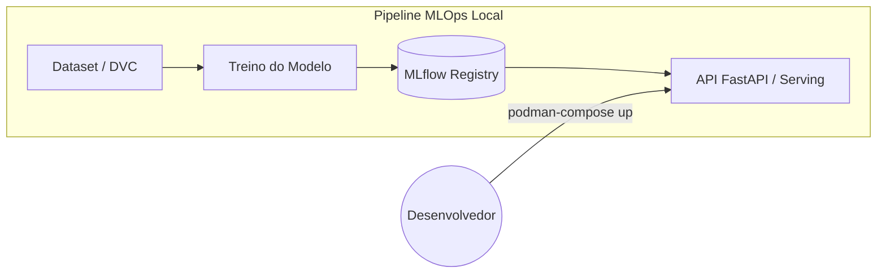

# Artefatos do Encontro



> 📁 Arquivos prontos para os labs: `encontro3-files/`
> Inclui scripts de treino, dvc setup, API de serving.
---
← [[note_class_02|Encontro 2]] | [[note_devops_mlops_eng_dados|Voltar ao Índice]]

# Encontro 3 — MLOps e Operacionalização de Modelos

## Objetivo do Encontro

Ao final deste encontro o aluno será capaz de rastrear experimentos com MLflow, versionar dados com DVC, registrar e servir modelos via container, completando o pipeline end-to-end do projeto incremental.

---

## Parte 1 — Teoria

### 3.1 MLOps: Ciclo de Vida e Maturidade

- O que é MLOps? Interseção de ML + DevOps + Data Engineering
- Ciclo de vida de modelos: experimentação → treino → validação → deploy → monitoramento
- Níveis de maturidade MLOps (Google):
  - Nível 0: Processo manual
  - Nível 1: Pipeline de ML automatizado
  - Nível 2: CI/CD para ML
- Technical debt em ML: features ocultas, feedback loops, configuração

**Referências:**
- Sculley et al., "Hidden Technical Debt in Machine Learning Systems" (NeurIPS, 2015) — <https://papers.nips.cc/paper/2015/hash/86df7dcfd896fcaf2674f757a2463eba-Abstract.html>
- Google, "MLOps: Continuous delivery and automation pipelines in machine learning" — <https://cloud.google.com/architecture/mlops-continuous-delivery-and-automation-pipelines-in-machine-learning>
- Kreuzberger et al., "Machine Learning Operations (MLOps): Overview, Definition, and Architecture" (2023) — DOI: [10.1109/ACCESS.2023.3262138](https://doi.org/10.1109/ACCESS.2023.3262138)

### 3.2 Experiment Tracking com MLflow

- MLflow: componentes (Tracking, Projects, Models, Registry)
- Tracking: experiments, runs, parameters, metrics, artifacts
- Model Registry: versionamento, staging, production, archived
- MLflow UI: visualização e comparação de experimentos
- Integração com scikit-learn, XGBoost, PyTorch

**Referências:**
- MLflow Docs: <https://mlflow.org/docs/latest/index.html>
- Zaharia et al., "Accelerating the Machine Learning Lifecycle with MLflow" (2018) — DOI: [10.1109/DSAA.2018.00025](https://doi.org/10.1109/DSAA.2018.00025) — <https://cs.stanford.edu/~matei/papers/2018/ieee_mlflow.pdf>

### 3.3 Versionamento de Dados e Modelos

- Por que versionar dados? Reprodutibilidade, auditoria, rollback
- DVC (Data Version Control): conceitos, remote storage, pipelines
- Git LFS: quando usar vs DVC
- Integração DVC + Git: `.dvc` files, `dvc.yaml`, `dvc.lock`
- Boas práticas: dados nunca no Git, sempre rastreados

**Referências:**
- DVC Docs: <https://dvc.org/doc> — [GitHub](https://github.com/iterative/dvc)
- Garage (S3-compatible object storage): <https://garagehq.deuxfleurs.fr/>
- Garage Quick Start: <https://garagehq.deuxfleurs.fr/documentation/quick-start/>

### 3.4 Feature Stores e Model Serving

- Feature stores: o que são, por que importam (Feast como exemplo)
- Padrões de serving: batch vs real-time vs streaming
- Model serving com containers: MLflow serve, BentoML, FastAPI + modelo
- A/B testing e canary deployments para modelos
- Monitoramento de modelo: data drift, concept drift, performance decay

**Referências:**
- Feast Docs: <https://docs.feast.dev/>
- BentoML Docs: <https://docs.bentoml.com/>

### 3.5 Kubeflow, Governança e Ética em ML

- Kubeflow: visão geral e quando usar (trade-offs de complexidade vs Airflow/Dagster)
- Kubeflow Pipelines: DAGs para ML, componentes reutilizáveis (contexto, sem lab)
- Model cards: documentação padronizada de modelos
- Data lineage: rastreabilidade de dados do raw ao modelo
- Viés e fairness: considerações éticas
- Regulamentação: LGPD e impacto em pipelines de ML

**Referências:**
- Kubeflow Docs: <https://www.kubeflow.org/docs/>
- Mitchell et al., "Model Cards for Model Reporting" (2019) — [arXiv:1810.03993](https://arxiv.org/abs/1810.03993)
- Gebru et al., "Datasheets for Datasets" (2021) — [arXiv:1803.09010](https://arxiv.org/abs/1803.09010)

---
# Artefatos-base do Encontro

- **Repositório-base** com código e dependências do projeto dos Encontros 1 e 2
- **Dataset de exemplo** versionado em formato apropriado
- **Script de treino** simples (ex: scikit-learn)
- **Manifests base** para MLflow no `compose.yaml`

---
## Parte 2 — Laboratórios Práticos (Visão em Sala + Execução em Casa)

> [!INFO] Dinâmica dos Laboratórios
> Durante o encontro presencial/síncrono, os labs a seguir serão **"pincelados"** pelo professor. O foco da aula é apresentar o funcionamento das ferramentas na prática e solucionar dúvidas de arquitetura, garantindo que você tenha a base necessária.
>
> A execução e conclusão completa de **todos os laboratórios** é parte da avaliação do curso e deve ser feita como trabalho de casa (Homework).

> [!TIP] Foco Personalizado
> Lembre-se: o conteúdo é amplo. Adapte os labs ao seu objetivo principal na pós-graduação. Se você tem maior interesse em MLOps e Automação, aprofunde-se na infra do MLflow, DVC e conteinerização do serving. Se prefere Engenharia/Ciência de Dados, invista mais tempo na exploração dos experimentos do modelo e documentação das métricas.

### Lab 3.1 — Experiment Tracking com MLflow

**Objetivo:** Integrar MLflow ao projeto para rastrear experimentos de modelo.

> 🧩 **Exemplo Unitário (MLflow Básico)**
> O MLflow exige poucas linhas para começar a rastrear:
> ```python
> import mlflow
> 
> mlflow.set_tracking_uri("http://localhost:5000")
> mlflow.set_experiment("Experimento_Didatico")
> 
> with mlflow.start_run():
>     # Log de configuração (parâmetros)
>     mlflow.log_param("algoritmo", "RandomForest")
>     
>     # Log de resultado (métricas)
>     mlflow.log_metric("acuracia", 0.95)
>     
>     print("Salvo no MLflow!")
> ```

**Passos:**
1. Adicionar MLflow ao `compose.yaml` (server + backend store PostgreSQL)
2. Criar script de treino simples (ex: classificação ou regressão com scikit-learn)
3. Logar parâmetros, métricas e artefatos no MLflow
4. Comparar 3+ experimentos com hiperparâmetros diferentes na UI
5. Registrar melhor modelo no Model Registry (staging → production)

**Entregável:** MLflow rodando via compose + pelo menos 3 experimentos logados.

### Lab 3.2 — Versionamento de Dados com DVC

**Objetivo:** Versionar o dataset do projeto com DVC.

> 🧩 **Exemplo Unitário (Comandos Básicos do DVC)**
> O DVC funciona como um "Git para arquivos grandes":
> ```bash
> # 1. Inicia o DVC no projeto (como um git init)
> dvc init
> 
> # 2. Rastreia o arquivo pesado (gera um arquivo leve .dvc)
> dvc add data/meu_dataset_pesado.csv
> 
> # 3. Commita apenas o arquivo leve (.dvc) no Git
> git add data/meu_dataset_pesado.csv.dvc
> git commit -m "Track dataset com DVC"
> 
> # 4. Envia o dado pesado para o storage remoto (S3)
> dvc push
> ```

**Passos:**
1. Instalar DVC e inicializar no repositório (`dvc init`)
2. Adicionar dataset ao tracking DVC (`dvc add data/raw/`)
3. Configurar remote storage local (ou Garage do compose, compatível com API S3)
4. Fazer push dos dados (`dvc push`)
5. Simular alteração no dataset → novo commit DVC
6. Demonstrar rollback para versão anterior

**Entregável:** Dataset versionado com DVC, `.dvc` files commitados no Git.

### Lab 3.3 — Model Serving via Container

**Objetivo:** Servir o modelo treinado como API REST.

> 🧩 **Exemplo Unitário (Model Serving com FastAPI)**
> Isolando a lógica, servir um modelo significa apenas carregá-lo na inicialização e usá-lo em uma rota:
> ```python
> from fastapi import FastAPI
> import mlflow.pyfunc
> import pandas as pd
> 
> app = FastAPI()
> 
> # Carrega o modelo na memória apenas 1 vez (quando a API liga)
> modelo = mlflow.pyfunc.load_model("models:/SimplesClassifier/latest")
> 
> @app.post("/predict")
> def prever(dados: dict):
>     # Converte o JSON recebido e passa para o modelo
>     df = pd.DataFrame([dados])
>     resultado = modelo.predict(df)
>     
>     return {"predicao": resultado[0]}
> ```

**Passos:**
1. Exportar modelo do MLflow Registry
2. Opção A (Rápida): Usar `mlflow models serve` em container para testes de sanidade locais
3. Opção B (Recomendada): Criar FastAPI wrapper + Containerfile (reflete o padrão de mercado para regras de validação/negócio)
4. Adicionar serviço de serving ao `compose.yaml`
5. Testar endpoint com `curl` ou script Python
6. Documentar API (inputs, outputs, exemplos)

**Entregável:** Modelo servido via container, acessível por HTTP.

### Lab 3.4 — Integração Final e Documentação do Slice de ML

**Objetivo:** Fechar o slice de ML do projeto, consolidando treino, versionamento e serving com documentação final clara.

**Passos:**
1. Revisar o fluxo consolidado: ingestão → transformação → treino → registro → serving
2. Garantir a execução local dos componentes de ML via `podman-compose up` e/ou `make`
3. Escrever README final com:
   - Arquitetura do pipeline (diagrama)
   - Instruções de setup e execução
   - Uso da API de serving
   - Decisões técnicas documentadas
   - Screenshots/evidências
4. Documentar 2 ADRs finais:
   - estratégia de tracking/versionamento
   - estratégia de serving
5. Registrar backlog de extensões pós-curso (opcional): monitoramento de drift, CI de treino, deploy Kubernetes/Helm

**Entregável:** Repositório completo com o slice de ML funcional e documentação final consistente.

> ⚠️ **Escopo mínimo do encontro:** atualização de CI para stages de ML e deploy em Kubernetes ficam como extensão opcional, não como requisito obrigatório da entrega final.

---

## Critério mínimo de conclusão do encontro

- MLflow registra experimentos e permite comparação entre runs
- DVC versiona pelo menos uma versão do dataset com evidência de push/rollback
- Serving do modelo responde por HTTP com documentação mínima de uso
- README final consolida arquitetura, setup e decisões técnicas

---

## Atividade de Reposição

Para alunos que não puderem comparecer ao Encontro 3:

1. **Fork** do repositório atualizado da turma (com código dos Encontros 1 e 2)
2. Implementar **Labs 3.1 a 3.4** completos
3. **Evidências obrigatórias:**
   - Screenshot do MLflow UI com experimentos logados
   - Output do `dvc status` mostrando dados versionados
   - Screenshot do endpoint de serving respondendo (`curl` output)
   - README final com diagrama de arquitetura
4. Submeter via **Pull Request** com descrição detalhada
5. **Gravar vídeo de 10 minutos** demonstrando o pipeline completo rodando

**Prazo:** 2 semanas após o Encontro 3.

> 💬 **Dúvidas:** alunos em reposição podem buscar suporte via **Issues no repositório da turma**.

---

## Checklist do Encontro

- [ ] MLflow server preparado no compose (testar antes)
- [ ] DVC instalado nos ambientes dos alunos
- [ ] Dataset de exemplo preparado (limpo e documentado)
- [ ] Modelo de exemplo funcional (scikit-learn simples)
- [ ] Repositório da turma atualizado com código dos Encontros 1 e 2
- [ ] README final e ADRs preparados como base para o fechamento do projeto

---

# Curiosidades

- *(Em breve)*
