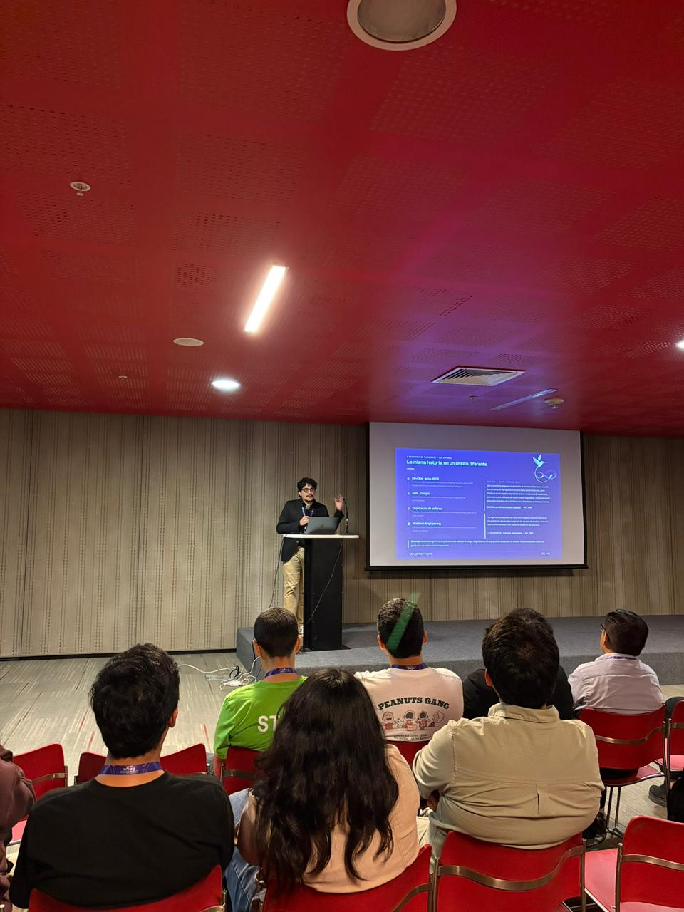
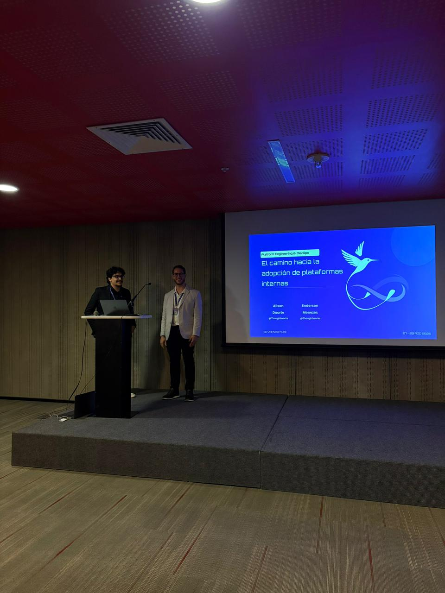

## Sobre o Evento

- **Nome**: DevOpsDays Lima 2026
- **Data**: 27–28/08/2026
- **Local / Sede**: Lima
- **Cidade / País**: Lima / Peru
- **Organizador**: DevOpsDays Peru
- **Link**: https://devopsdays.pe/

## Palestras Apresentadas

- *El camino hacia la adopción de plataformas internas* — Speakers: Enderson Menezes & Alison Duarte — [Talk no site oficial](https://talks.devopsdays.org/devopsdays-lima-2026/talk/9WEZHM/)

## Programação / Trilhas
<!-- Palestras ou sessões que assistiu, com speaker quando relevante -->

## Materiais e Fotos
<!-- Preferir links relativos para imagens em assets/ -->
- Slides:
- Fotos:
  - 
  - 

## Observações

- Palestra em co-apresentação com Alison Duarte.
- Conteúdo derivado da talk base [Engenharia de Dados para Engenharia de Plataformas](../presentations/talk-data-engineering-to-platform-engineering.md), adaptado para o contexto de adoção de plataformas internas no DevOpsDays Lima.
