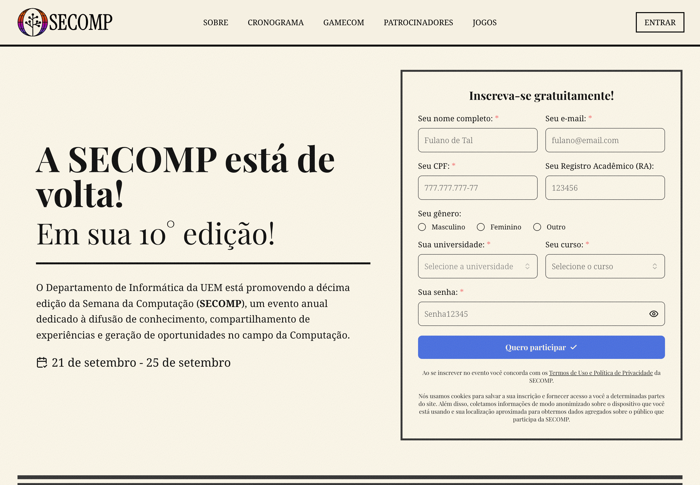

## Sobre o Evento

- **Nome**: X SECOMP — Semana da Computação (UEM)
- **Data**: 21–25/09/2026 (palestra em 23/09, quarta-feira)
- **Local / Sede**: Pró Reitoria de Ensino - B33 UEM
- **Cidade / País**: Maringá / Brasil
- **Organizador**: Departamento de Informática (DIN) - UEM
- **Link**: https://www.secompuem.com.br/

## Palestras Apresentadas

- *GitHub e Comunidade Open Source* — Speaker: Enderson Menezes — 23/09 (quarta-feira), 14:00–15:00 — Pró Reitoria de Ensino - B33 UEM
  - Descrição no site: "Open Source não é apenas uma licença de software — é um modelo de produção coletiva, estudado por economistas, sociólogos e cientistas da computação, que está redefinindo como o mundo cria, compartilha e sustenta tecnologia. Esta palestra conecta a base acadêmica do movimento a práticas concretas de contribuição no GitHub."

## Programação / Trilhas
<!-- Palestras ou sessões que assistiu, com speaker quando relevante -->

## Materiais e Fotos
<!-- Preferir links relativos para imagens em assets/ -->
- Slides:
- Fotos:
- Banner do site (capturado em 23/09/2026): 

## Observações

- Conteúdo derivado da talk base [GitHub and Open Source Community](../presentations/talk_github_and_open_source_community.md).
