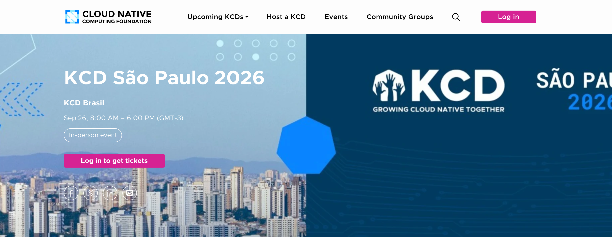

## Sobre o Evento

- **Nome**: KCD São Paulo 2026 (KCD Brasil)
- **Data**: 26/09/2026 (sábado, 8:00–18:00 GMT-3)
- **Local / Sede**: Nubank Spark — Av. Manuel Bandeira, 346 - Vila Leopoldina
- **Cidade / País**: São Paulo / Brasil
- **Organizador**: CNCF Community / KCD Brasil
- **Link**: https://community2.cncf.io/events/details/cncf-kcd-brasil-presents-kcd-sao-paulo-2026/

## Palestras Apresentadas

- *Modelando seu IDP: A fundação da Engenharia de Plataforma* — Speakers: Enderson Menezes & Alison Duarte
  - Descrição enviada: "A adoção de Portais Internos de Desenvolvedor (IDPs) — como Backstage, Port.io ou Cortex — tornou-se o padrão para iniciativas de Engenharia de Plataforma. No entanto, muitas organizações falham ao focar na ferramenta antes de estruturar sua arquitetura de informação. Esta palestra defende que a fundação de um IDP de sucesso é um modelo de dados robusto e agnóstico. Apresentaremos uma arquitetura de referência em formato Galaxy Schema. O público aprenderá como conectar ativos tecnológicos aos seus responsáveis, estruturar Scorecards reais e por que modelar conceitos de plataforma é o pré-requisito definitivo para uma adoção escalável."

## Programação / Trilhas
<!-- Palestras ou sessões que assistiu, com speaker quando relevante -->

## Materiais e Fotos
<!-- Preferir links relativos para imagens em assets/ -->
- Slides:
- Fotos:
- Banner do site (capturado em 23/09/2026): 

## Observações

- Palestra em co-apresentação com Alison Duarte.
- Conteúdo derivado da talk base [Engenharia de Dados para Engenharia de Plataformas](../presentations/talk-data-engineering-to-platform-engineering.md), adaptado para o contexto do KCD Brasil.
