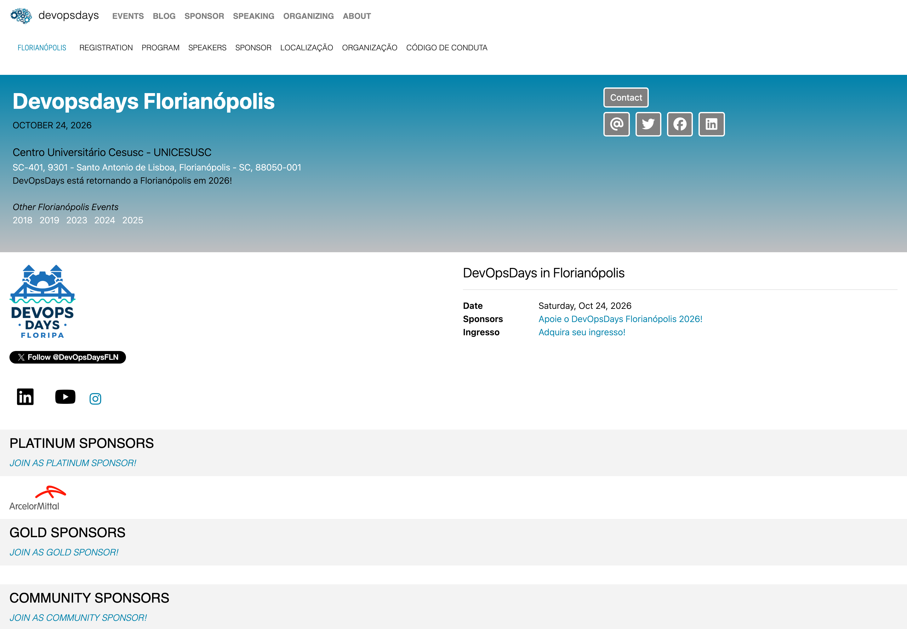

## Sobre o Evento

- **Nome**: DevOpsDays Florianópolis 2026
- **Data**: 24/10/2026 (sábado)
- **Local / Sede**: Centro Universitário Cesusc - UNICESUSC — SC-401, 9301 - Santo Antonio de Lisboa
- **Cidade / País**: Florianópolis / Brasil
- **Organizador**: DevOpsDays Florianópolis
- **Link**: https://devopsdays.org/events/2026-florianopolis/welcome/

## Palestras Apresentadas

- *Modelando seu IDP: A fundação da Engenharia de Plataforma* — Speaker: Enderson Menezes
  - Descrição enviada: "A adoção de Portais Internos de Desenvolvedor (IDPs) — como Backstage, Port.io ou Cortex — tornou-se o padrão para iniciativas de Engenharia de Plataforma. No entanto, muitas organizações falham ao focar na ferramenta antes de estruturar sua arquitetura de informação. Esta palestra defende que a fundação de um IDP de sucesso é um modelo de dados robusto e agnóstico. Apresentaremos uma arquitetura de referência em formato Galaxy Schema. O público aprenderá como conectar ativos tecnológicos aos seus responsáveis, estruturar Scorecards reais e por que modelar conceitos de plataforma é o pré-requisito definitivo para uma adoção escalável."

## Programação / Trilhas
<!-- Palestras ou sessões que assistiu, com speaker quando relevante -->

## Materiais e Fotos
<!-- Preferir links relativos para imagens em assets/ -->
- Slides:
- Fotos:
- Banner do site (capturado em 23/09/2026): 

## Observações

- Conteúdo derivado da talk base [Engenharia de Dados para Engenharia de Plataformas](../presentations/talk-data-engineering-to-platform-engineering.md), adaptado para o contexto do DevOpsDays Florianópolis.
